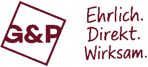
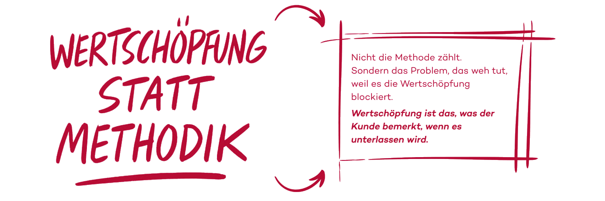
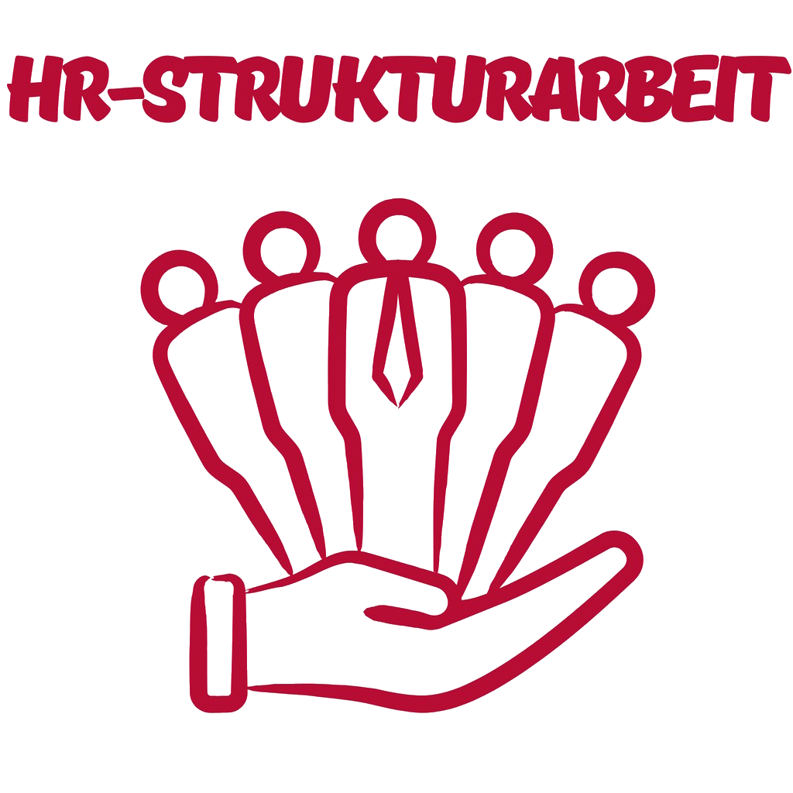
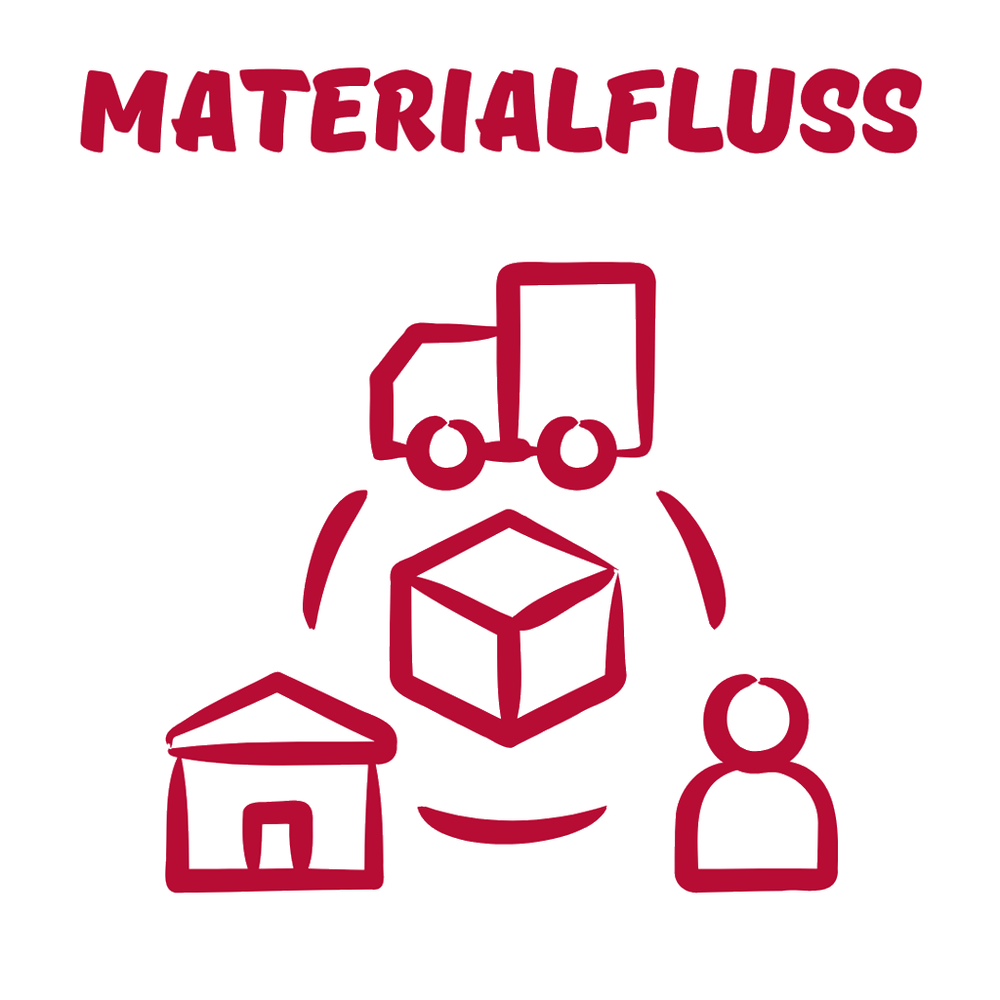
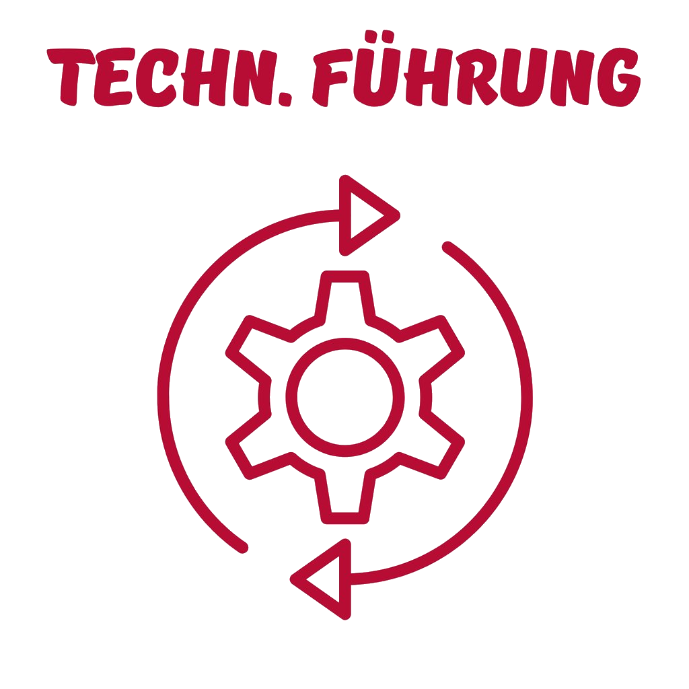
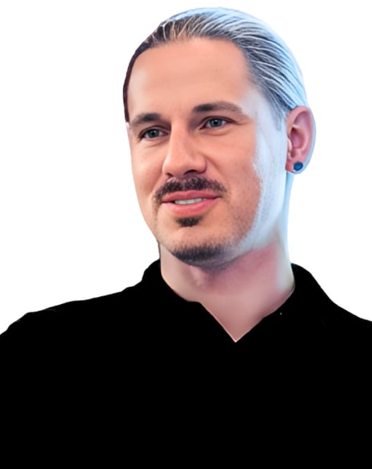
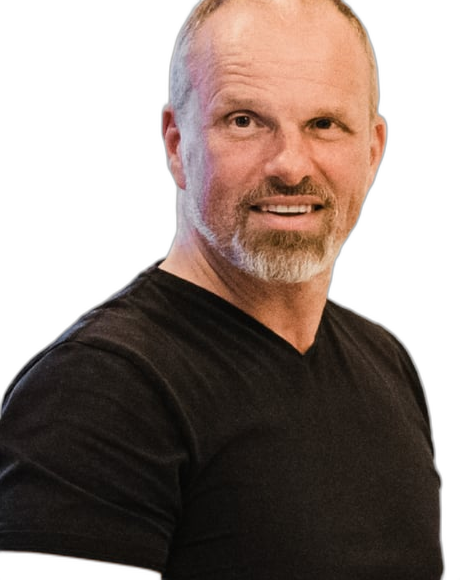

## {.title-slide background-color="#c41e3a"}

:::: {.columns}

::: {.column width="60%"}
{.logo-white height="80px"}

### Dramatische Leistungssteigerung{.title-text}
### für produzierende Unternehmen{.subtitle-text}

::: {.tagline}
Ehrlich. Direkt. Wirksam.
:::
:::

::: {.column width="40%"}
{.hero-icon}
:::

::::

## Wertschöpfung & Wettbewerbsfähigkeit{background-color="#1a1a2e"}

::: {.big-number}
50%
:::

::: {.big-claim}
Lieferzeiten halbieren. Ressourcen halbieren. Innovationen verdoppeln.
:::

. . .

::: {.contrast-text}
Kostendenken wird den typischen Mittelständler nicht retten.\
**Höchstleistung schon.**
:::

. . .

::: {.manifesto}
| Schnelle Erprobung | ~~statt sauteure Konzepte~~ |
| Echte Probleme lösen | ~~statt Methodik bis der Arzt kommt~~ |
| Mehr Wirkung | ~~statt mehr Manntage~~ |
:::

## Drei Hebel für Höchstleistung

:::: {.columns}

::: {.column width="33%"}
::: {.pillar-card}
{.pillar-icon}

### 01 Organisation, Führung & Können

Organisationen erzeugen Verhalten -- nicht umgekehrt. Wir arbeiten am System. Da Führung das System jeden Tag wieder erzeugt, arbeiten wir an Führung.

::: {.pillar-tag}
Führung als Gestaltungs-Kompetenz.
:::
:::
:::

::: {.column width="33%"}
::: {.pillar-card}
{.pillar-icon}

### 02 Lean -- also ReaLean

Ohne saugute Wertschöpfung ist alles andere nichts. Fluss erzeugen, Engpässe lösen, Verschwendung eliminieren.

::: {.pillar-tag}
Lean ohne Methodik -- aber mit konkreter Wirkung.
:::
:::
:::

::: {.column width="33%"}
::: {.pillar-card}
{.pillar-icon}

### 03 ERP & KI

Das ERP muss Rückenwind werden, nicht Hürdenlauf. KI bringt nur etwas, wenn Wertschöpfung wirklich besser wird.

::: {.pillar-tag}
ERP als Leistungs-Bremse -- oder Rückenwind?
:::
:::
:::

::::

## Team: Kompetenzen, die wirken

:::: {.columns}

::: {.column width="25%"}
::: {.team-member}
{.team-photo}

**Florian Glöbl**\
Geschäftsführer, Berater & Vernetzer

15+ Jahre Sondermaschinenbau
:::
:::

::: {.column width="25%"}
::: {.team-member}
{.team-photo}

**Benno Löffler**\
Gesellschafter & Systempraktiker

25+ Jahre Beratung. Autor „Saugute Zusammenarbeit"
:::
:::

::: {.column width="25%"}
::: {.team-member}
{.team-photo}

**Simone Heigl**\
Trainerin, Beraterin & Coach

Kommunikation, Resilienz, Klartext
:::
:::

::: {.column width="25%"}
::: {.team-member}
{.team-photo}

**David Weber**\
Lean-Berater & Wertschöpfungsexperte

Fluss erzeugen, Engpässe lösen
:::
:::

::::

## Vorgehen: Das Trafo-Modell{background-color="#f8f9fa"}

::: {.trafo-flow}

::: {.trafo-step .step-active}
**1. Orientierung**\
Verstehen, wo es weh tut. Klarheit über Engpässe und Höchstleistungskiller.
:::

::: {.trafo-arrow}
→
:::

::: {.trafo-step}
**2. Schnelle Erprobung**\
Kleine Experimente in der Wertschöpfung. Wirkt es? Dann mehr davon.
:::

::: {.trafo-arrow}
→
:::

::: {.trafo-step}
**3. Verankerung**\
Neue Praktiken in den Alltag überführen. Führung sichert den neuen Standard.
:::

:::

. . .

::: {.trafo-principles}
**Kein Riesenprojekt.** Kein Change-Management-Theater.\
Stattdessen: Erprobung → Wirkung → Entscheidung → nächster Schritt.
:::

## Bereit für Höchstleistung?{.final-slide background-color="#c41e3a"}

::: {.final-content}

Ein Gespräch. Du erzählst. Wir stellen Fragen. Du denkst nach.\
Und wenn Du dann nochmal sprechen willst, hat das Gespräch offenbar etwas bewirkt...

::: {.contact-block}
**Florian Glöbl**\
f.gloebl@g-und-p.de\
+49 (0) 172 / 1718875

G&P Management Consultants UG\
Birkenweg 6, 84082 Laberweinting
:::

::: {.cta-box}
Gespräch vereinbaren. Klartext. Versprochen.
:::

:::
